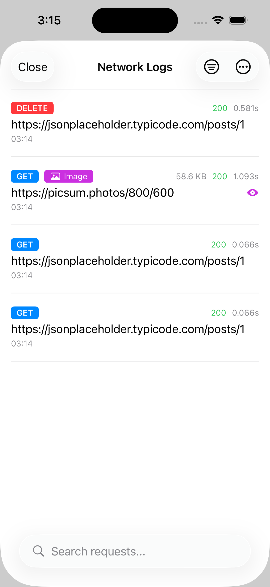

# NetworkUI

A SwiftUI library for network debugging that provides real-time network request logging and inspection for iOS applications.



## Features

- 🔍 **Real-time Network Monitoring** - Automatically intercept and log all network requests
- 📱 **SwiftUI Interface** - Beautiful, native SwiftUI views for browsing network logs
- 🔒 **Privacy Controls** - Built-in privacy settings to exclude sensitive headers and data
- 📊 **Detailed Request Info** - View complete request/response data including headers, body, and timing
- 🎯 **Advanced Filtering** - Filter logs by HTTP method, domain, status code, and media type
- 💾 **Persistent Storage** - Uses SwiftData for automatic log persistence
- 🔄 **Multiple Request Support** - Handle and display concurrent network requests

## Requirements

- iOS 17.0+
- Swift 6.1+

## Installation

### Swift Package Manager

Add NetworkUI to your project using Xcode:

1. File → Add Package Dependencies
2. Enter the repository URL: `https://github.com/noppefoxwolf/NetworkUI`
3. Select the latest version

Or add it to your `Package.swift`:

```swift
dependencies: [
    .package(url: "https://github.com/noppefoxwolf/NetworkUI", from: "1.0.0")
]
```

## Usage

### Basic Setup

1. Import NetworkUI in your app:

```swift
import NetworkUI
```

2. Register the network interceptor when your app starts:

```swift
NetworkInterceptor.register()
```

3. Add the network log view to your app:

```swift
import SwiftUI
import NetworkUI

struct ContentView: View {
    @State private var showingNetworkLogs = false
    
    var body: some View {
        VStack {
            Button("View Network Logs") {
                showingNetworkLogs = true
            }
        }
        .sheet(isPresented: $showingNetworkLogs) {
            NetworkLogView()
        }
    }
}
```

### Privacy Settings

Configure privacy settings to exclude sensitive information:

```swift
NetworkLogger.shared.privacySettings.excludeSensitiveHeaders = true
NetworkLogger.shared.privacySettings.excludeRequestBody = false
NetworkLogger.shared.privacySettings.excludeResponseBody = false

// Add custom sensitive headers
NetworkLogger.shared.privacySettings.addSensitiveHeader("X-Custom-Token")
```

### Persistence Control

Enable or disable log persistence:

```swift
NetworkLogger.shared.isPersistenceEnabled = true
```

### Clear Logs

Programmatically clear all network logs:

```swift
NetworkLogger.shared.clearLogs()
```

## Example App

The repository includes a complete example app in the `Example.swiftpm` directory that demonstrates:

- Different HTTP methods (GET, POST, PUT, DELETE)
- Multipart requests
- File downloads
- Error handling
- Network log viewing

To run the example:

1. Open `Example.swiftpm` in Xcode
2. Build and run the project
3. Tap various buttons to generate network requests
4. View the captured logs using the "View Network Logs" button

## Architecture

NetworkUI consists of several key components:

- **NetworkInterceptor**: Automatically intercepts URLSession requests
- **NetworkLogger**: Manages log storage and privacy settings
- **NetworkLogView**: SwiftUI interface for viewing and filtering logs
- **NetworkUIDataManager**: Handles SwiftData persistence
- **NetworkLogEntry**: Data model for individual network requests

## License

This project is available under the MIT license. See the LICENSE file for more info.